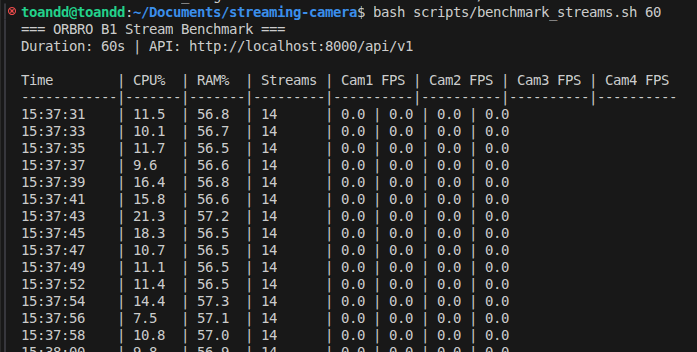
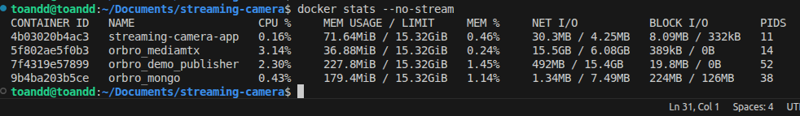

# Measurement Results

> Measurements taken on local development machine using `bash scripts/benchmark_streams.sh 60`

## Môi trường Thử nghiệm (Test Environment)

>`bash scripts/benchmark_streams.sh 60`.

| Thông số (Item) | Cấu hình thực tế (Actual Value) |
|------|-------|
| Hệ điều hành (OS) | Ubuntu 22.04.5 LTS |
| CPU | Intel Core i5-1135G7 @ 2.40GHz |
| RAM | 16 GB |
| GPU | Intel Iris Xe Graphics |
| Docker | Docker v29.1.3 |
| Nguồn Video | File H.264 mẫu tại `resources/videos/` đóng gói thành HLS qua MediaMTX |
| Số lượng luồng | 4 luồng HLS hiển thị đồng thời |

## 1. Kết quả đo lường (Results)

> Số liệu được lấy thực tế từ lệnh `docker stats` khi đang chạy 4 luồng HLS trên môi trường mô phỏng.

hình ảnh: 
| Metric | Thực tế đo lường (Actual Value) |
|--------|-------|
| **CPU Usage (FastAPI App)** | ~0.28% (Tác vụ Polling cực kỳ nhẹ) |
| **CPU Usage (MediaMTX)** | ~2.58% (Xử lý 4 luồng RTSP sang HLS) |
| **CPU Usage (FFmpeg Publisher)** | ~2.61% (Phát 4 luồng video mô phỏng) |
| **Tổng RAM tiêu thụ** | ~515 MiB (Bao gồm cả MongoDB, FastAPI, MediaMTX và FFmpeg) |
| **Thời gian phát hiện đứt kết nối** | < 5 giây (Do chu kỳ Polling là 5s) |
| **Thời gian tự động khôi phục (Auto-reconnect)** | Tự động khôi phục và phát hình lại trên Web trong < 3 giây sau khi RTSP Source có tín hiệu. |

## 2. Kiểm thử tự động kết nối lại (Reconnect Test)

1. Tắt nguồn phát: `docker compose --profile demo stop demo-publisher`.
2. Ghi nhận log: Sau 5 giây, toàn bộ 4 camera trên màn hình chuyển sang màu Vàng (Trạng thái `RECONNECTING`).
3. Bật lại nguồn phát: `docker compose --profile demo up -d demo-publisher`.
4. Ghi nhận log: Sau 3-5 giây, toàn bộ 4 camera chuyển lại màu Xanh (Trạng thái `CONNECTED`).
5. Kiểm tra CSDL: Bộ đếm `reconnect_count` tăng thêm 1 và ghi nhận 2 sự kiện (CAMERA_DISCONNECTED, CAMERA_RECONNECTED) vào Collection `stream_events`.

## 3. Phân tích mở rộng (Scaling Analysis 32 - 80 Kênh)

Dựa trên số liệu đo lường thực tế ở cấu hình hiện tại (Intel Core i5-1135G7):

### 3.1 Căn cứ ngoại suy (Extrapolation Basis)
- **MediaMTX:** 4 luồng tốn 2.58% CPU. Suy ra 80 luồng sẽ tốn khoảng `2.58 * 20 = 51.6%` CPU (trên tổng 800% của 8 luồng xử lý/threads).
- **FFmpeg (Stream-copy):** 4 luồng tốn 2.61% CPU. Suy ra 80 luồng tốn khoảng `52%` CPU.
- **FastAPI:** Polling 80 luồng từ API nội bộ của MediaMTX vẫn sẽ duy trì mức CPU dưới 5% vì không giải mã frame.
- **RAM:** Tổng RAM cho 80 luồng dự kiến tốn dưới 2 GB.

**Kết luận hiệu năng dự kiến:** 
Cấu hình máy hiện tại (Intel i5, 16GB RAM) **hoàn toàn có thể chạy mượt mà 80 luồng ở Backend** mà không bị quá tải CPU/RAM. 

### 3.2 Các nút thắt cổ chai thực sự (Real Bottlenecks)

1. **Băng thông mạng (Network I/O):** Mỗi luồng HLS 720p tiêu tốn khoảng 2Mbps. 80 luồng đồng thời = 160 Mbps liên tục đẩy về trình duyệt. Cần mạng Gigabit LAN.
2. **Quá tải Trình duyệt (Browser Rendering):** Trình duyệt phải duy trì 80 kết nối HTTP tải HLS segment và 80 vòng lặp `requestAnimationFrame` vẽ Canvas. Điều này sẽ làm treo trình duyệt của Client.
3. **Giới hạn kết nối HTTP/1.1:** Trình duyệt giới hạn 6 kết nối đồng thời đến cùng một tên miền. Nếu có 80 thẻ video tải HLS đồng thời qua HTTP/1.1, các file segment sẽ bị chặn hàng đợi chờ tải.

### 3.3 Hướng giải quyết cho Production
- Chuyển MediaMTX sang hỗ trợ **HTTP/2** hoặc **WebRTC** để giảm overhead kết nối.
- Giao diện người dùng phải áp dụng **Lazy Loading** (Chỉ load và vẽ Canvas những camera đang nằm trong vùng hiển thị của màn hình, tạm dừng những camera bị cuộn khuất).
- Sử dụng **Load Balancer (Nginx)** để phân tán băng thông ra nhiều node nếu số lượng người dùng đồng thời truy cập lưới 80 camera tăng cao.
