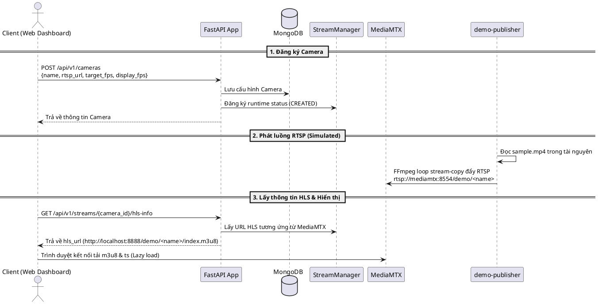
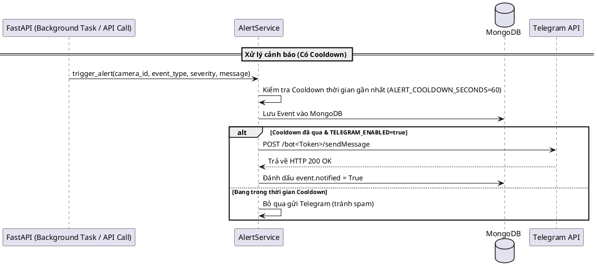
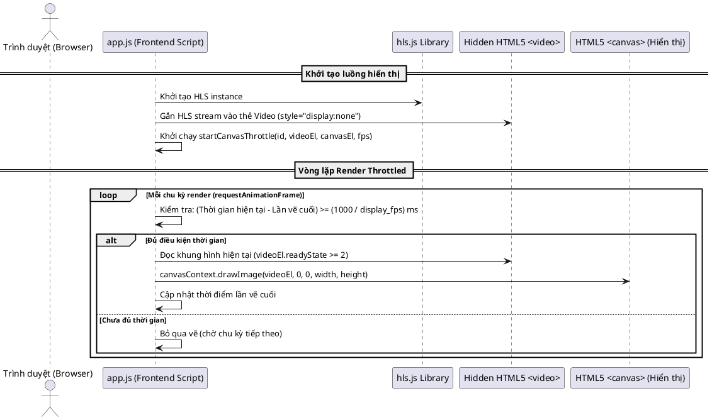

# System Processing Flows (Sơ đồ luồng xử lý hệ thống)

Tài liệu này chứa các sơ đồ luồng xử lý chi tiết của dự án, được vẽ bằng ngôn ngữ **PlantUML**. Bạn có thể dùng các công cụ hỗ trợ render PlantUML trực tuyến hoặc plugin trong VS Code để xem trực quan các sơ đồ này.

---

## 1. Luồng Đăng ký Camera & Phát Video (Registration & Streaming Flow)

Mô tả luồng từ lúc người dùng đăng ký một camera mới, video mẫu được phát lặp lại (loop) dưới dạng RTSP bởi FFmpeg/MediaMTX, cho đến khi trình duyệt hiển thị video qua giao thức HLS.



---

## 2. Luồng Giám sát & Tự động kết nối lại (Status Polling & Reconnect Flow)

Mô tả luồng kiểm tra trạng thái camera định kỳ thông qua API của MediaMTX. Khi xảy ra sự cố mất kết nối thực tế, hệ thống sẽ tự động thử kết nối lại và gửi cảnh báo tới Telegram sau 10 giây nếu sự cố vẫn tiếp diễn.

```plantuml
@startuml
participant SM as "StreamManager (Poller Loop)"
participant MTX as "MediaMTX API"
participant AS as "AlertService"
database DB as "MongoDB"
participant Tele as "Telegram API"

loop Định kỳ mỗi 5 giây (hoặc chu kỳ cấu hình)
    SM -> MTX : GET /v3/paths/list
    MTX --> SM : Trả về danh sách luồng RTSP đang active
    
    alt Luồng RTSP tồn tại (CONNECTED)
        SM -> SM : Cập nhật trạng thái = CONNECTED\nTăng uptime_seconds\nReset reconnect_count & timeout_alerted
    else Luồng RTSP không tồn tại (DISCONNECTED)
        alt Trạng thái trước đó là CONNECTED
            SM -> SM : Chuyển trạng thái = RECONNECTING\nGhi nhận thời điểm last_disconnected_at
            SM -> AS : Phát sự kiện CAMERA_DISCONNECTED
            AS -> DB : Lưu Event (Severity: WARNING)
            AS -> Tele : Gửi thông báo Telegram (nếu enabled)
        else Đang ở trạng thái RECONNECTING
            SM -> SM : Tăng reconnect_count
            alt Quá 10 giây chưa kết nối lại & chưa gửi alert
                SM -> SM : Đánh dấu reconnect_timeout_alerted = True
                SM -> AS : Phát sự kiện RECONNECT_TIMEOUT
                AS -> DB : Lưu Event (Severity: ERROR)
                AS -> Tele : Gửi thông báo Telegram cảnh báo mất kết nối quá 10s
            end
        fi
    fi
end
@enduml
```

---

## 3. Luồng Cảnh báo Telegram & Cơ chế Cooldown (Telegram Alerting & Cooldown Flow)

Mô tả cơ chế kiểm soát và lọc các cảnh báo trùng lặp (ví dụ: cảnh báo quá tải CPU/RAM hoặc camera liên tục mất kết nối) để tránh tình trạng spam tin nhắn Telegram của người dùng bằng cách áp dụng thời gian cooldown (60 giây).



---

## 4. Luồng Canvas Visual FPS Throttling (Client-side Canvas FPS Throttling)

Mô tả luồng hiển thị video giới hạn khung hình (FPS) ở phía giao diện trình duyệt nhằm giảm thiểu việc sử dụng CPU của thiết bị xem mà không cần phải giải mã lại video phía server.


